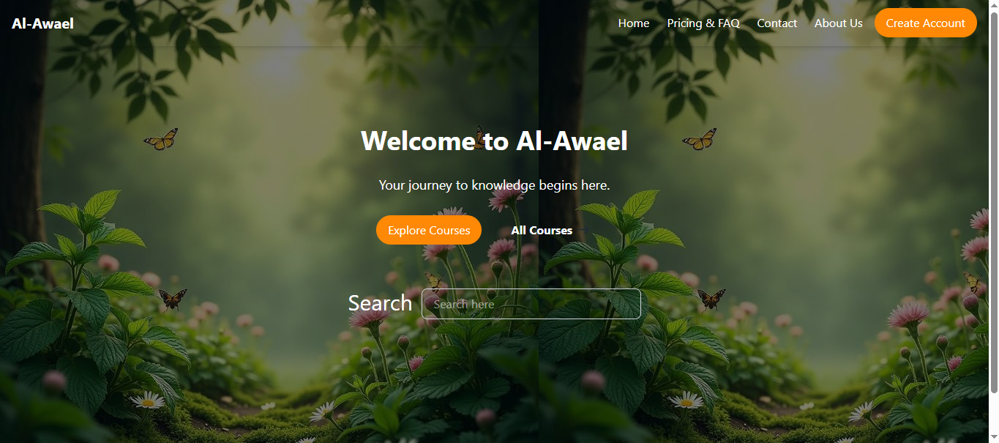

# 📚 Task LMS

A Learning Management System (LMS) built with **React (Vite)**, **Node.js/Express**, and **MongoDB**.  
It allows students to browse courses, enroll, and track progress, while instructors and admins manage content and users.

---

## 🚀 Features

- 🔐 Authentication (JWT-based login & logout)
- 👩‍🎓 Student dashboard (view & enroll in courses)
- 👨‍🏫 Instructor dashboard (manage courses & students)
- 🛠 Admin dashboard (manage users & system settings)
- 📱 Responsive design with TailwindCSS
- ⚡ Fast front-end powered by React + Vite

---

## 🛠 Tech Stack

**Frontend:** React, Vite, TailwindCSS, React Router  
**Backend:** Node.js, Express, MongoDB, JWT Authentication  
**Deployment:** Vercel (frontend), Railway/Render/Atlas (backend + DB)

---

## 📂 Project Structure

---

## ⚡ Getting Started

### 1. Clone the repo

```bash
git clone https://github.com/your-username/task-lms.git
cd task-lms
```

### 2. Install dependencies

-Frontend:
cd client
npm install

Backend:
cd server
npm install

### 4. Run the app

Start frontend:
cd client
npm run dev

Start backend:
cd server
npm run dev

🌍 Deployment

Frontend deployed on Vercel

Backend deployed on Railway

📸 ```Screenshots
```

👤 Author
MOHAMED AWAD – [GitHub](https://github.com/midrra)
| [LinkedIn](https://www.linkedin.com/in/mohamed-3wad/)
